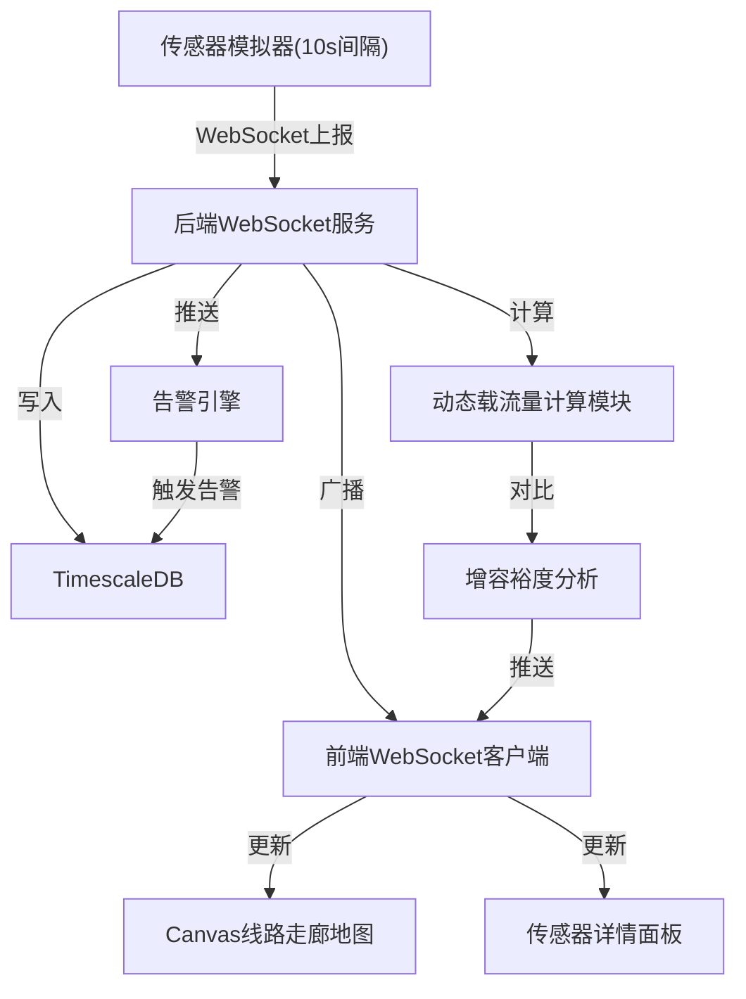

## 1. 产品概述

电网输电线路动态增容监测系统——基于实时气象与导线温度数据，计算线路动态载流量并与静态载流量对比显示增容裕度，实现输电线路安全运行的可视化监控与智能告警。

- 面向电网调度中心运维人员，解决输电线路在高温高负荷条件下容量评估不精确的问题
- 通过动态增容技术挖掘线路输电潜力，提升电网输送能力5%~30%，降低限电风险

## 2. 核心功能

### 2.1 用户角色

| 角色 | 权限 |
|------|------|
| 调度员 | 实时监控线路状态、查看告警、查看动态增容数据 |
| 管理员 | 配置传感器、管理告警规则、导出历史数据 |

### 2.2 功能模块

1. **实时监控大屏**：线路走廊地图、传感器标记点实时颜色变化、动态载流量/静态载流量对比、关键指标仪表板
2. **传感器详情面板**：近1小时温度/风速/日照趋势曲线、实时数值显示
3. **告警中心**：过热告警、线路舞动告警、传感器离线告警、告警记录查询
4. **增容分析**：动态载流量曲线、静态载流量对比、增容裕度百分比展示

### 2.3 页面详情

| 页面名称 | 模块名称 | 功能描述 |
|----------|----------|----------|
| 实时监控大屏 | 线路走廊地图 | Canvas绘制200km线路走廊，传感器以标记点显示，颜色按温度比例变化（绿<80%、黄80%-95%、红>95%） |
| 实时监控大屏 | 关键指标面板 | 显示当前最高温度、平均风速、总日照强度、在线传感器数 |
| 实时监控大屏 | 增容裕度面板 | 动态载流量vs静态载流量对比柱状图、增容百分比 |
| 传感器详情面板 | 趋势曲线 | 近1小时温度、风速、日照三条趋势曲线 |
| 传感器详情面板 | 实时数值 | 当前传感器读数、状态、位置信息 |
| 告警中心 | 告警列表 | 按类型筛选的告警记录列表，包含时间、类型、传感器、级别 |
| 告警中心 | 告警统计 | 各类告警数量统计 |

## 3. 核心流程

传感器每10秒上报数据 → 后端WebSocket接收 → 存入TimescaleDB → 实时计算动态载流量 → 告警规则引擎检测 → 前端WebSocket推送更新 → Canvas重绘地图标记

## 4. 用户界面设计

### 4.1 设计风格

- 主色调：深蓝色背景(#0a1628)搭配科技蓝(#00d4ff)强调色，工业监控风格
- 辅助色：告警红(#ff4757)、预警黄(#ffa502)、安全绿(#2ed573)
- 字体：思源黑体/Noto Sans SC，数据用等宽字体 JetBrains Mono
- 布局：全屏监控大屏风格，左侧地图区域占70%，右侧信息面板占30%
- 图标：线条风格，lucide-react图标库

### 4.2 页面设计概览

| 页面名称 | 模块名称 | UI元素 |
|----------|----------|--------|
| 实时监控大屏 | 线路走廊地图 | Canvas深色地图背景、绿色/黄色/红色传感器标记点、悬停高亮、点击弹出 |
| 实时监控大屏 | 关键指标面板 | 数字卡片、仪表盘、闪烁动画表示数据刷新 |
| 传感器详情面板 | 趋势曲线 | 三条折线图(温度/风速/日照)、时间轴1小时、实时滚动 |
| 告警中心 | 告警列表 | 表格、红色/黄色标签、闪烁新告警 |

### 4.3 响应式设计

- 桌面优先设计，最低分辨率1920x1080
- 地图区域自适应缩放
- 信息面板可折叠/展开

### 4.4 动态效果

- 传感器标记点呼吸动画表示数据刷新
- 告警标记点闪烁动画
- 数据流粒子效果沿线路流动
- 面板切换平滑过渡动画
