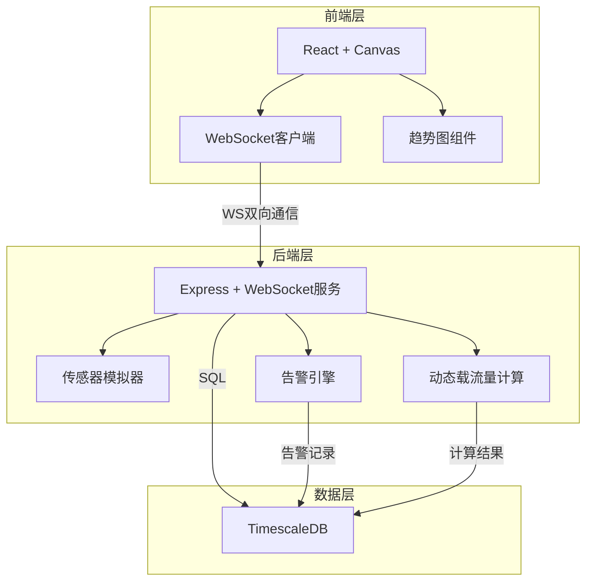
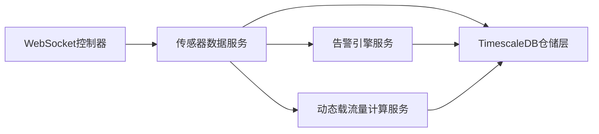
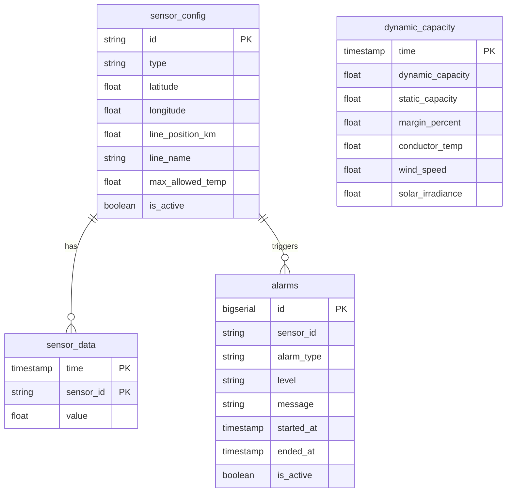

## 1. 架构设计



## 2. 技术说明

- 前端：React@18 + TypeScript + Tailwind CSS + Vite + Canvas API
- 初始化工具：vite-init (react-express-ts模板)
- 后端：Express@4 + ws (WebSocket) + TypeScript (ESM)
- 数据库：TimescaleDB (PostgreSQL扩展)
- 状态管理：Zustand
- 图表：Canvas自绘趋势曲线

## 3. 路由定义

| 路由 | 用途 |
|------|------|
| / | 实时监控大屏主页面 |
| /alarms | 告警中心页面 |

## 4. API定义

### WebSocket消息协议

```typescript
interface SensorDataMessage {
  type: 'sensor_data'
  sensors: Array<{
    id: string
    type: 'temperature' | 'wind' | 'solar'
    value: number
    timestamp: string
  }>
}

interface AlarmMessage {
  type: 'alarm'
  alarm: {
    id: string
    sensorId: string
    alarmType: 'overheat' | 'galloping' | 'offline'
    level: 'warning' | 'critical'
    message: string
    timestamp: string
  }
}

interface CapacityMessage {
  type: 'capacity'
  data: {
    dynamicCapacity: number
    staticCapacity: number
    margin: number
    timestamp: string
  }
}

interface HistoryRequest {
  type: 'history_request'
  sensorId: string
  hours: number
}

interface HistoryResponse {
  type: 'history_response'
  sensorId: string
  data: Array<{
    timestamp: string
    value: number
  }>
}
```

### REST API

| 接口 | 方法 | 用途 |
|------|------|------|
| /api/sensors | GET | 获取所有传感器配置 |
| /api/sensors/:id/history | GET | 获取传感器历史数据 |
| /api/alarms | GET | 获取告警记录列表 |
| /api/capacity/current | GET | 获取当前动态载流量 |
| /api/capacity/history | GET | 获取载流量历史 |

## 5. 服务端架构图



## 6. 数据模型

### 6.1 数据模型定义



### 6.2 数据定义语言

```sql
-- 传感器配置表
CREATE TABLE sensor_config (
  id VARCHAR(20) PRIMARY KEY,
  type VARCHAR(20) NOT NULL CHECK (type IN ('temperature', 'wind', 'solar')),
  latitude FLOAT NOT NULL,
  longitude FLOAT NOT NULL,
  line_position_km FLOAT NOT NULL,
  line_name VARCHAR(50) NOT NULL DEFAULT '主干线',
  max_allowed_temp FLOAT DEFAULT 70.0,
  is_active BOOLEAN DEFAULT TRUE
);

-- 传感器时序数据（TimescaleDB超表）
CREATE TABLE sensor_data (
  time TIMESTAMPTZ NOT NULL,
  sensor_id VARCHAR(20) NOT NULL,
  value FLOAT NOT NULL,
  FOREIGN KEY (sensor_id) REFERENCES sensor_config(id)
);
SELECT create_hypertable('sensor_data', 'time', chunk_time_interval => INTERVAL '1 hour');

-- 告警记录表
CREATE TABLE alarms (
  id BIGSERIAL PRIMARY KEY,
  sensor_id VARCHAR(20) NOT NULL,
  alarm_type VARCHAR(20) NOT NULL CHECK (alarm_type IN ('overheat', 'galloping', 'offline')),
  level VARCHAR(20) NOT NULL CHECK (level IN ('warning', 'critical')),
  message TEXT NOT NULL,
  started_at TIMESTAMPTZ NOT NULL,
  ended_at TIMESTAMPTZ,
  is_active BOOLEAN DEFAULT TRUE,
  FOREIGN KEY (sensor_id) REFERENCES sensor_config(id)
);

-- 动态载流量记录表
CREATE TABLE dynamic_capacity (
  time TIMESTAMPTZ NOT NULL,
  dynamic_capacity FLOAT NOT NULL,
  static_capacity FLOAT NOT NULL,
  margin_percent FLOAT NOT NULL,
  conductor_temp FLOAT,
  wind_speed FLOAT,
  solar_irradiance FLOAT
);
SELECT create_hypertable('dynamic_capacity', 'time', chunk_time_interval => INTERVAL '1 day');

-- 索引
CREATE INDEX idx_sensor_data_sensor_id ON sensor_data (sensor_id, time DESC);
CREATE INDEX idx_alarms_sensor_id ON alarms (sensor_id, started_at DESC);
CREATE INDEX idx_alarms_active ON alarms (is_active) WHERE is_active = TRUE;
CREATE INDEX idx_dynamic_capacity_time ON dynamic_capacity (time DESC);
```
