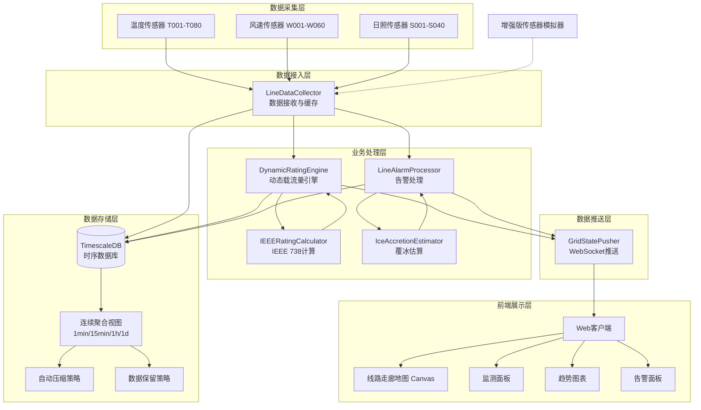
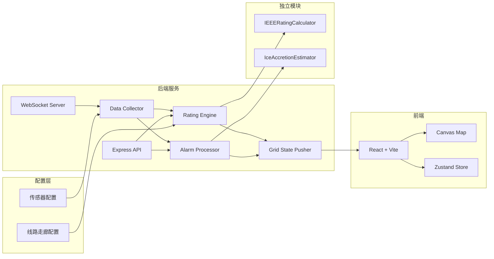

# 电网输电线路动态增容监测系统

## 项目概述

本系统是一个完整的电网输电线路动态增容监测全栈应用，用于实时监测200公里输电线路的运行状态，通过实时气象数据和导线温度计算动态载流量，实现智能告警和增容分析。

### 系统特点

- **实时监测**：180个传感器（80个温度、60个风速、40个日照）每10秒上报数据
- **动态载流量计算**：基于IEEE 738标准，考虑实时气象条件计算线路最大允许载流量
- **智能告警**：过热告警（含覆冰风险因子）、线路舞动告警、传感器离线告警
- **可视化展示**：Canvas绘制线路走廊地图，传感器颜色实时变化
- **历史趋势**：近1小时温度、风速、日照趋势曲线
- **增容分析**：动态载流量与静态载流量对比，显示增容裕度
- **工程化部署**：Docker容器化部署，TimescaleDB自动压缩和连续聚合

---

## 系统架构

### 架构图



### 模块架构



### 数据流

```
传感器 → WebSocket → LineDataCollector → 缓存
                                    ↳ 批量写入 → TimescaleDB
                                    ↳ 事件通知 → DynamicRatingEngine → IEEERatingCalculator → 计算结果 → 推送前端
                                    ↳ 事件通知 → LineAlarmProcessor → IceAccretionEstimator → 告警判定 → 推送前端
```

---

## 技术栈

### 后端
- **运行时**：Node.js 20 + TypeScript (ESM)
- **Web框架**：Express.js
- **WebSocket**：ws
- **数据库**：PostgreSQL 16 + TimescaleDB
- **数据库驱动**：node-postgres (pg)

### 前端
- **框架**：React 18 + TypeScript
- **构建工具**：Vite 6
- **状态管理**：Zustand 5
- **样式**：Tailwind CSS 3
- **可视化**：Canvas API
- **图标**：Lucide React
- **路由**：React Router 7

### 部署与运维
- **容器化**：Docker + Docker Compose
- **反向代理**：Nginx
- **时序优化**：TimescaleDB 连续聚合、自动压缩、数据保留策略

---

## 项目结构

```
├── api/                                    # 后端代码
│   ├── modules/                           # 核心业务模块（重构后）
│   │   ├── line-data-collector.ts       # 数据接收与缓存
│   │   ├── dynamic-rating-engine.ts      # 动态载流量引擎
│   │   ├── ieee-rating-calculator.ts  # IEEE 738标准计算
│   │   ├── line-alarm-processor.ts     # 告警状态机处理
│   │   ├── ice-accretion-estimator.ts # 覆冰因子估算
│   │   └── grid-state-pusher.ts        # WebSocket状态推送
│   ├── routes/                          # API路由
│   │   ├── auth.ts
│   │   ├── sensors.ts                   # 传感器相关API
│   │   ├── alarms.ts                    # 告警相关API
│   │   └── capacity.ts                # 载流量相关API
│   ├── app.ts                          # Express应用
│   ├── server.ts                       # 服务器入口
│   ├── db.ts                           # 数据库连接和操作
│   ├── websocket-server.ts             # WebSocket服务器
│   ├── capacity-calculator.ts          # 兼容层
│   ├── enhanced-sensor-simulator.ts   # 增强版传感器模拟器
│   ├── sensor-simulator-cli.ts         # 模拟器CLI工具
│   └── sensor-simulator.ts             # 基础传感器模拟器
├── config/
│   ├── line-corridor.ts                # 线路走廊配置（杆塔坐标、线路路径）
│   └── sensors.ts                      # 传感器配置
├── sql/
│   ├── init.sql                         # 数据库初始化脚本（含压缩策略）
│   ├── continuous-aggregates.sql          # 连续聚合配置
│   └── insert_sensors.sql               # 传感器数据插入脚本
├── src/                                 # 前端代码
│   ├── components/
│   │   ├── Header.tsx                   # 顶部状态栏
│   │   ├── LineCorridorMap.tsx          # Canvas线路走廊地图
│   │   ├── SensorDetailPanel.tsx        # 传感器详情面板
│   │   ├── AlarmPanel.tsx             # 告警面板
│   │   ├── CapacityPanel.tsx          # 增容裕度面板
│   │   └── TrendChart.tsx            # 趋势曲线图
│   ├── hooks/
│   │   └── useWebSocket.ts           # WebSocket Hook
│   ├── store/
│   │   └── index.ts                   # Zustand状态管理
│   ├── pages/
│   │   └── Home.tsx                   # 主页面
│   └── index.css                      # 全局样式
├── Dockerfile.backend                   # 后端Dockerfile
├── Dockerfile.frontend                  # 前端Dockerfile
├── docker-compose.yml                  # Docker Compose配置
├── nginx.conf                        # Nginx配置
├── .dockerignore                     # Docker忽略文件
├── .env                              # 环境配置
└── package.json                      # 项目依赖
```

---

## 快速开始

### 1. 环境要求

- Node.js >= 20
- Docker >= 24
- Docker Compose >= 2
- 可选：PostgreSQL >= 16 + TimescaleDB >= 2.13

### 2. Docker 一键部署（推荐）

#### 启动全部服务

```bash
# 构建并启动全部服务
npm run docker:up
```

#### 查看服务状态

```bash
npm run docker:ps
```

#### 查看日志

```bash
# 全部服务日志
npm run docker:logs

# 查看特定服务日志
docker-compose logs -f timescaledb
docker-compose logs -f backend
docker-compose logs -f frontend
```

#### 停止服务

```bash
npm run docker:down

# 停止并清理数据卷
npm run docker:down -v
```

#### 服务访问地址

| 服务 | 地址 | 说明 |
|------|------|------|
| 前端 | http://localhost:8080 | Web监控大屏 |
| 后端API | http://localhost:3001 | REST API和WebSocket |
| 数据库 | localhost:5432 | PostgreSQL + TimescaleDB |

### 3. 本地开发模式

#### 安装依赖

```bash
npm install
```

#### 配置环境变量

编辑 `.env` 文件：

```env
# 服务端口
PORT=3001
VITE_WS_URL=ws://localhost:3001
VITE_API_URL=http://localhost:3001

# 数据库配置
DB_HOST=localhost
DB_PORT=5432
DB_NAME=power_grid
DB_USER=postgres
DB_PASSWORD=postgres

# 业务参数
STATIC_CAPACITY=1000
MAX_ALLOWED_TEMP=70
LINE_LENGTH_KM=200
SENSOR_REPORT_INTERVAL=10000

# 模拟器配置（可选）
SIMULATOR_WS_URL=ws://localhost:3001/ws
SIMULATOR_INTERVAL=10000
```

#### 初始化数据库

```bash
# 创建数据库
psql -U postgres -c "CREATE DATABASE power_grid;"

# 执行初始化脚本
psql -U postgres -d power_grid -f sql/init.sql

# 配置连续聚合
psql -U postgres -d power_grid -f sql/continuous-aggregates.sql
```

#### 启动开发服务

```bash
# 同时启动前端和后端
npm run dev

# 或分别启动
npm run server:dev  # 后端（端口3001）
npm run client:dev  # 前端（端口5173）
```

---

## 传感器配置

### 配置格式

传感器配置定义在 [config/sensors.ts](file:///c:/Users/10996/Desktop/AI_solo_coder_task_A/AI_solo_coder_task_A_057/config/sensors.ts)：

```typescript
export interface SensorConfig {
  id: string                    // 传感器ID，如"T001"
  type: 'temperature' | 'wind' | 'solar'  // 传感器类型
  latitude: number              // 纬度
  longitude: number             // 经度
  linePositionKm: number        // 线路公里标
  lineName: string              // 线路名称
  maxAllowedTemp: number         // 最大允许温度（仅温度传感器）
  isActive: boolean              // 是否启用
}
```

### 传感器类型与分布

| 类型 | 数量 | 编号规则 | 单位 | 间隔 |
|------|------|----------|------|------|
| 温度传感器 | 80 | T001-T080 | °C | 2.5km |
| 风速传感器 | 60 | W001-W060 | m/s | 3.3km |
| 日照强度传感器 | 40 | S001-S040 | W/m² | 5.0km |

### 颜色编码规则

温度传感器根据温度与最大允许温度的比例显示不同颜色：

- **绿色** (#2ed573)：< 80% (< 56°C) - 安全
- **黄色** (#ffa502)：80% - 95% (56°C - 66.5°C) - 预警
- **红色** (#ff4757)：> 95% (> 66.5°C) - 告警

### 添加自定义传感器

```typescript
// 在 config/sensors.ts 中添加：
{
  id: 'T081',
  type: 'temperature',
  latitude: 30.123,
  longitude: 114.456,
  linePositionKm: 198.5,
  lineName: '主干线',
  maxAllowedTemp: 70.0,
  isActive: true,
}
```

---

## 线路走廊配置

线路走廊配置定义在 [config/line-corridor.ts](file:///c:/Users/10996/Desktop/AI_solo_coder_task_A/AI_solo_coder_task_A_057/config/line-corridor.ts)：

### 杆塔配置格式

```typescript
export interface TowerConfig {
  id: string                    // 杆塔ID，如"T000"
  name: string                  // 杆塔名称
  km: number                    // 公里标
  latitude: number              // 纬度
  longitude: number             // 经度
  elevation: number              // 海拔高度（米）
  towerType: 'tangent' | 'angle' | 'dead-end'  // 杆塔类型
}
```

### 导线规格

| 型号 | 导线直径 | 直流电阻 | 最大允许温度 |
|------|----------|----------|--------------|
| LGJ-240/30 | 21.6mm | 0.1181 Ω/km | 70°C |
| LGJ-300/40 | 23.94mm | 0.0939 Ω/km | 70°C |
| LGJ-400/35 | 26.82mm | 0.0723 Ω/km | 70°C |
| LGJ-630/45 | 33.6mm | 0.0459 Ω/km | 70°C |

---

## 增强版传感器模拟器

### 功能特性

1. **日变化规律**：基于24小时周期模式，模拟真实的昼夜温度、风速、日照变化
2. **季节调整**：春夏秋冬四季参数自动调整
3. **天气模拟**：晴天、多云、雨天、暴风雨、雪天
4. **位置影响**：线路不同位置的气象参数差异
5. **异常事件**：可配置概率的异常高温、大风等异常事件
6. **随机波动**：高斯随机噪声，模拟真实传感器误差
7. **趋势追踪**：平滑的全局趋势变化

### 模拟器配置参数

```typescript
interface SimulatorConfig {
  baseTemp: number              // 基础温度（°C）
  baseWind: number              // 基础风速（m/s）
  baseSolar: number             // 基础日照（W/m²）
  tempAmplitude: number         // 温度日变化幅度
  windAmplitude: number        // 风速日变化幅度
  solarAmplitude: number       // 日照日变化幅度
  tempRandomness: number        // 温度随机噪声强度
  windRandomness: number         // 风速随机噪声强度
  solarRandomness: number        // 日照随机噪声强度
  tempHourlyPattern: number[]     // 温度24小时模式数组
  windHourlyPattern: number[]     // 风速24小时模式数组
  solarHourlyPattern: number[]    // 日照24小时模式数组
  positionFactorStrength: number  // 位置影响强度
  anomalyProbability: number    // 异常事件概率
  anomalyMultiplier: number      // 异常事件强度倍数
  season: 'spring' | 'summer' | 'autumn' | 'winter'  // 季节
  weather: 'sunny' | 'cloudy' | 'rainy' | 'stormy' | 'snowy'  // 天气
}
```

### CLI 使用方法

```bash
# 查看帮助
npm run simulator -- --help

# 启动模拟器（默认间隔10秒）
npm run simulator

# 启动模拟器，5秒间隔
npm run simulator -- -i 5000

# 设置暴风雨天气，增加异常概率
npm run simulator:storm

# 设置冬季场景
npm run simulator:winter

# 只发送一次测试数据
npm run simulator:test

# 自定义参数组合使用方法
npm run simulator -- \
  --weather cloudy \
  --season summer \
  --temp 35 \
  --wind 12 \
  --solar 900 \
  --anomaly 0.05 \
  --verbose
```

### 独立运行模拟器（不依赖主服务）

```bash
# 连接到远程服务器
node --import tsx api/sensor-simulator-cli.ts \
  --url ws://your-server:3001/ws \
  --interval 5000
```

### 天气类型影响系数

| 天气 | 温度系数 | 日照系数 | 风速系数 |
|------|----------|----------|----------|
| sunny | 1.0 | 1.0 | 0.9 |
| cloudy | 0.9 | 0.5 | 1.0 |
| rainy | 0.8 | 0.2 | 1.3 |
| stormy | 0.75 | 0.1 | 1.8 |
| snowy | 0.5 | 0.3 | 1.5 |

### 季节类型影响系数

| 季节 | 温度系数 | 日照系数 | 风速系数 |
|------|----------|----------|----------|
| spring | 1.0 | 0.8 | 1.1 |
| summer | 1.3 | 1.2 | 0.8 |
| autumn | 0.9 | 0.7 | 1.2 |
| winter | 0.6 | 0.5 | 1.3 |

---

## 告警规则

### 1. 过热告警

- **触发条件**：导线温度超过最大允许温度(70°C)持续5分钟
- **级别**：严重 (critical)
- **处理**：系统自动记录，提示运维人员
- **改进**：考虑覆冰风险因子调整告警阈值

### 2. 线路舞动告警

- **触发条件**：风速超过动态调整阈值（基础30m/s，覆冰时降低）
- **级别**：严重 (critical)
- **动态阈值**：`threshold = 30 * (1 - icingRiskFactor)，最低15m/s
- **覆冰风险因子**：基于温度(-5°C~5°C最优)和湿度(>80%)计算
- **处理**：可能引发线路舞动，需密切关注

### 3. 传感器离线告警

- **触发条件**：传感器超过5分钟未上报数据
- **级别**：警告 (warning)
- **处理**：检查传感器通信和供电

---

## TimescaleDB 优化策略

### 自动压缩策略

| 表 | 压缩时间 | 分片字段 | 排序字段 |
|----|----------|----------|----------|
| sensor_data | 7天后 | sensor_id | time DESC |
| dynamic_capacity | 30天后 | - | time DESC |
| sensor_data_1min | 1小时后 | sensor_id | bucket DESC |
| sensor_data_15min | 1天后 | sensor_id | bucket DESC |
| sensor_data_1h | 7天后 | sensor_id | bucket DESC |
| sensor_data_1d | 30天后 | sensor_id | bucket DESC |

### 连续聚合视图

| 视图 | 聚合粒度 | 刷新间隔 | 保留时间 |
|------|----------|----------|----------|
| sensor_data_1min | 1分钟 | 30秒 | 7天 |
| sensor_data_15min | 15分钟 | 5分钟 | 30天 |
| sensor_data_1h | 1小时 | 30分钟 | 180天 |
| sensor_data_1d | 1天 | 每天02:00 | 3年 |
| temperature_1min | 1分钟 | 30秒 | 7天 |
| wind_1min | 1分钟 | 30秒 | 7天 |
| solar_1min | 1分钟 | 30秒 | 7天 |
| alarm_stats_1d | 1天 | 每天01:00 | - |
| capacity_stats_1h | 1小时 | 30分钟 | - |

### 数据保留策略

| 表/视图 | 保留时间 |
|----------|----------|
| sensor_data（原始数据） | 90天 |
| dynamic_capacity | 365天 |
| sensor_data_1min | 7天 |
| sensor_data_15min | 30天 |
| sensor_data_1h | 180天 |
| sensor_data_1d | 3年 |

### 超表Chunk配置

```sql
-- sensor_data 超表
SELECT create_hypertable(
  'sensor_data',
  'time',
  chunk_time_interval => INTERVAL '1 day',
  if_not_exists => TRUE
);

-- dynamic_capacity 超表
SELECT create_hypertable(
  'dynamic_capacity',
  'time',
  chunk_time_interval => INTERVAL '7 days',
  if_not_exists => TRUE
);
```

---

## API 接口

### REST API

| 接口 | 方法 | 描述 |
|------|------|------|
| `/api/health` | GET | 健康检查 |
| `/api/sensors` | GET | 获取所有传感器配置 |
| `/api/sensors/:id` | GET | 获取单个传感器信息 |
| `/api/sensors/:id/history` | GET | 获取传感器历史数据 |
| `/api/sensors/:id/latest` | GET | 获取传感器最新数据 |
| `/api/alarms/active` | GET | 获取活动告警列表 |
| `/api/alarms/history` | GET | 获取告警历史记录 |
| `/api/alarms/stats` | GET | 获取告警统计 |
| `/api/alarms/:id/acknowledge` | POST | 确认告警 |
| `/api/capacity/current` | GET | 获取当前动态载流量 |
| `/api/capacity/history` | GET | 获取载流量历史 |
| `/api/capacity/calculate` | POST | 计算动态载流量 |
| `/api/capacity/conductors` | GET | 获取导线规格列表 |
| `/api/capacity/calculate/line` | POST | 计算全线路载流量 |

### WebSocket 消息协议

#### 服务端 → 客户端

```typescript
// 初始数据
interface InitialDataMessage {
  type: 'initial_data'
  sensors: SensorConfig[]
  sensorData: SensorData[]
  capacity: CapacityData | null
  alarms: Alarm[]
}

// 传感器数据更新
interface SensorDataMessage {
  type: 'sensor_data'
  sensors: SensorReading[]
}

// 载流量更新
interface CapacityMessage {
  type: 'capacity'
  data: CapacityData
}

// 告警通知
interface AlarmMessage {
  type: 'alarm'
  alarm: Alarm
}

// 历史数据响应
interface HistoryResponseMessage {
  type: 'history_response'
  sensorId: string
  data: HistoryData[]
}
```

#### 客户端 → 服务端

```typescript
// 请求历史数据
interface HistoryRequest {
  type: 'history_request'
  sensorId: string
  hours: number
}

// 上报传感器数据（真实传感器）
interface SensorDataUpload {
  type: 'sensor_data'
  sensors: SensorReading[]
}
```

---

## 动态载流量计算原理

### IEEE 738 热平衡方程

导线的热平衡方程为：

```
Q_joule + Q_solar = Q_convection + Q_radiation
```

其中：
- `Q_joule`：焦耳热（电流产生的热量）
- `Q_solar`：日照吸收的热量
- `Q_convection`：对流散热
- `Q_radiation`：辐射散热

### 计算模型

1. **对流冷却**：基于雷诺数和努塞尔数计算，区分自然对流和强制对流
2. **辐射冷却**：基于斯特藩-玻尔兹曼定律
3. **日照加热**：基于太阳辐照度和吸热系数，考虑云量修正
4. **焦耳热**：基于导线电阻和电流

### 云量修正

```
有效辐照度 = 实测日照强度 / 理论最大日照
云量因子 = min(1, 实测日照强度 / 1000)
修正后日照加热 = Q_solar * 云量因子
```

### 增容裕度

```
增容裕度 = ((动态载流量 - 静态载流量) / 静态载流量 × 100%
```

---

## Docker 部署详情

### 服务编排

[docker-compose.yml](file:///c:/Users/10996/Desktop/AI_solo_coder_task_A/AI_solo_coder_task_A_057/docker-compose.yml) 定义了三个服务：

1. **timescaledb**：时序数据库服务
2. **backend**：Node.js 后端服务
3. **frontend**：Nginx 前端服务

### 后端 Dockerfile

[Dockerfile.backend](file:///c:/Users/10996/Desktop/AI_solo_coder_task_A/AI_solo_coder_task_A_057/Dockerfile.backend) 使用多阶段构建：

- **deps 阶段**：安装生产依赖
- **builder 阶段**：TypeScript 编译检查
- **runner 阶段**：生产运行，包含健康检查

### 前端 Dockerfile

[Dockerfile.frontend](file:///c:/Users/10996/Desktop/AI_solo_coder_task_A/AI_solo_coder_task_A_057/Dockerfile.frontend) 使用多阶段构建：

- **deps 阶段**：安装依赖
- **builder 阶段**：Vite 构建生产版本
- **runner 阶段**：Nginx 托管静态文件

### Nginx 配置

[nginx.conf](file:///c:/Users/10996/Desktop/AI_solo_coder_task_A/AI_solo_coder_task_A_057/nginx.conf) 提供：

- 静态文件托管
- `/api` 路径反向代理到后端
- `/ws` WebSocket 代理（支持 Upgrade）
- Gzip 压缩
- 静态资源缓存策略

### 数据库初始化

Docker 首次启动时自动执行 `sql/` 目录下的 SQL 脚本：

1. `init.sql`：创建表结构、超表、压缩策略、保留策略
2. `continuous-aggregates.sql`：创建连续聚合视图和刷新策略

### 健康检查

所有服务都配置了健康检查：

```yaml
healthcheck:
  test: ["CMD", "..."]
  interval: 30s
  timeout: 5s
  retries: 3
  start_period: 30s
```

---

## 系统监控与运维

### 查看服务状态

```bash
# 查看全部服务状态
npm run docker:ps

# 查看资源使用
docker stats

# 查看数据库连接
psql -U postgres -d power_grid -c "SELECT * FROM pg_stat_activity;"
```

### 数据库维护

```sql
-- 查看压缩状态
SELECT * FROM timescaledb_information.compression_stats;

-- 查看连续聚合状态
SELECT * FROM timescaledb_information.continuous_aggregates;

-- 查看chunk信息
SELECT chunk_name, range_start, range_end
FROM timescaledb_information.chunks
WHERE hypertable_name = 'sensor_data'
ORDER BY range_start DESC
LIMIT 10;

-- 查看表大小
SELECT
  hypertable_name,
  pg_size_pretty(hypertable_size(hypertable_name)) AS total_size
FROM timescaledb_information.hypertables;
```

### 日志管理

```bash
# 查看最近100行日志
docker-compose logs --tail=100 backend

# 实时追踪日志
npm run docker:logs

# 导出日志
docker-compose logs backend > backend.log
```

### 数据备份

```bash
# 备份数据库
docker exec power-grid-timescaledb pg_dump -U postgres power_grid > backup_$(date +%Y%m%d).sql

# 恢复数据库
docker exec -i power-grid-timescaledb psql -U postgres power_grid < backup_20240101.sql
```

---

## 性能优化建议

1. **数据库性能**：已配置合理的 shared_buffers、work_mem 等参数
2. **写入优化**：批量写入（每5000ms或180条）
3. **查询优化**：合理的索引策略
4. **压缩策略**：旧数据自动压缩，节省存储空间
4. **连续聚合**：预聚合大幅提升查询性能
5. **数据保留**：自动清理过期数据

---

## 故障排查

### 数据库连接失败

检查 `.env` 中的数据库配置，确认PostgreSQL服务运行，TimescaleDB扩展已安装。

### WebSocket连接失败

检查端口是否被占用，确认 `VITE_WS_URL` 配置正确。

### 前端显示空白

打开浏览器开发者工具，检查控制台错误信息，确认后端服务已启动。

### 传感器数据不更新

1. 检查后端日志确认数据在接收
2. 检查WebSocket连接状态
3. 确认模拟器是否在运行

### Docker 服务启动失败

```bash
# 查看详细错误
docker-compose logs timescaledb

# 重新构建
docker-compose build --no-cache

# 清理并重新启动
docker-compose down -v
docker-compose up -d
```

---

## 开发规范

### 代码规范

- 使用 TypeScript ESM 模块
- 遵循单一职责原则
- 模块间通过事件驱动解耦
- 完备的空值防护
- 完善的类型注解

### 提交规范

```
feat: 新功能
fix: 修复bug
docs: 文档更新
style: 代码格式
refactor: 重构
test: 测试相关
chore: 构建/工具相关
```

---

## 许可证

MIT License

---

## 联系方式

如有问题或建议，请提交 Issue 或 PR。
